**Note:** For the screenshots, you can store all of your answer images in the `answer-img` directory.

## Verify the monitoring installation

*TODO:* run `kubectl` command to show the running pods and services for all components. Take a screenshot of the output and include it here to verify the installation

### Monitoring Namespace

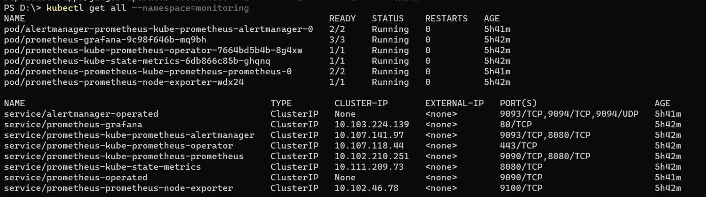

### Observability Namespace

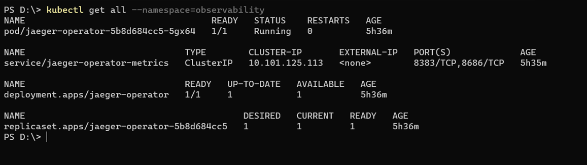

### Flask Application

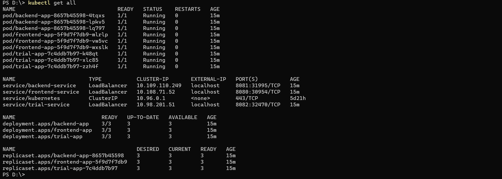

## Setup the Jaeger and Prometheus source

### Grafana Homepage

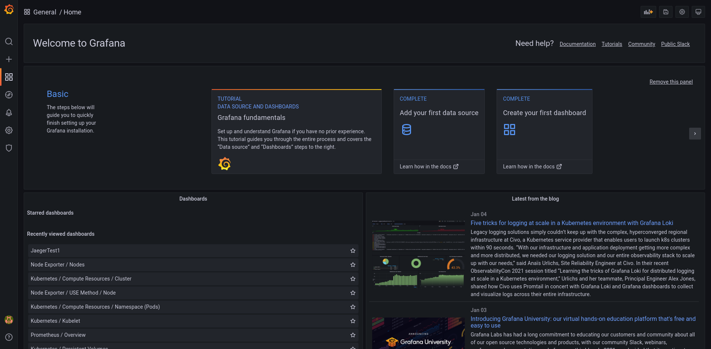

### Grafana Sources

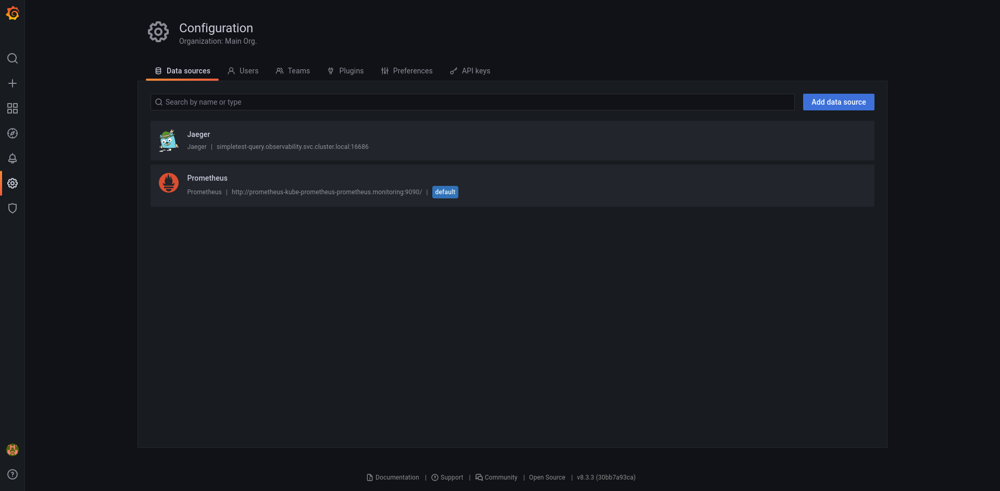

## Create a Basic Dashboard

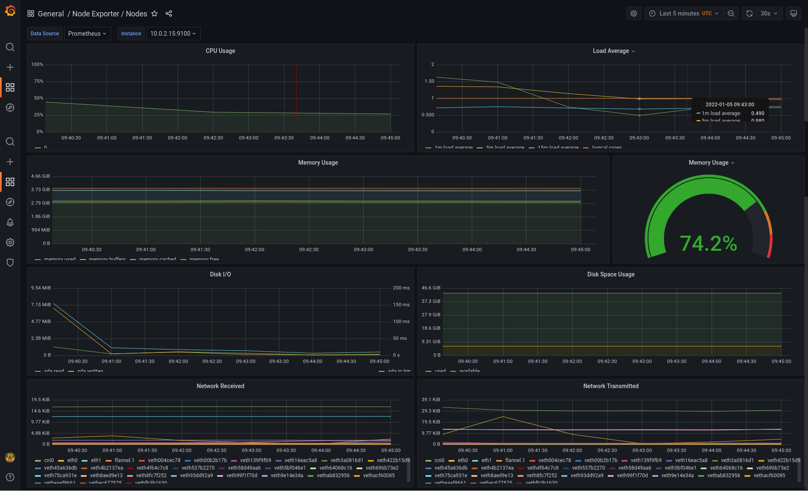

## Describe SLO/SLI

Service Level Objectives (SLOs) define the acceptable level of performance or reliability for a service over a certain period of time. They provide a clear target for how well a service should perform.

Service Level Indicators (SLIs), on the other hand, are specific metrics or measurements that help track the performance or reliability of a service. They are the quantitative or qualitative measures used to assess whether the service is meeting its objectives.

In the context of a service with an SLO of monthly uptime and request response time, SLIs would be the actual measurements or data points used to evaluate these aspects. For example:

For monthly uptime: SLIs could include metrics like the percentage of time the service is available in a month or the number of minutes of downtime experienced.
For request response time: SLIs could include metrics like average response time for requests, latency distribution (e.g., 95th percentile response time), or error rates.

## Creating SLI metrics

With the principles of the Four Golden Signals (latency, traffic, error rates, and system load):
- Count of 40x response errors.
- Count of 50x response errors.
- Service Uptime, which tracks the operational period of our systems.
- CPU Load, representing the current percentage of utilized processing resources.
- Processing Time, the interval needed to handle and respond to an inquiry.

## Create a Dashboard to measure our SLIs

*TODO:* Create a dashboard to measure the uptime of the frontend and backend services We will also want to measure to measure 40x and 50x errors. Create a dashboard that show these values over a 24 hour period and take a screenshot.
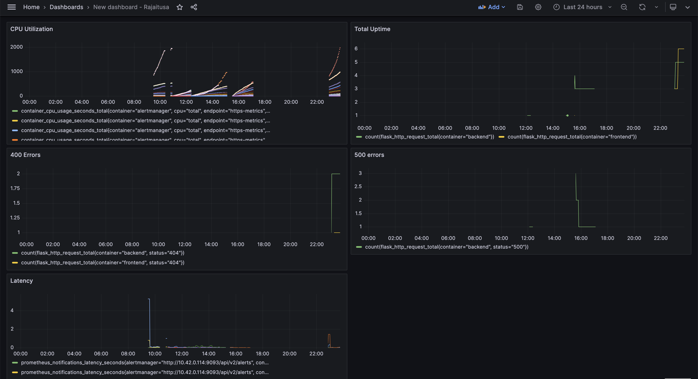

## Tracing our Flask App

*TODO:*  We will create a Jaeger span to measure the processes on the backend. Once you fill in the span, provide a screenshot of it here. Also provide a (screenshot) sample Python file containing a trace and span code used to perform Jaeger traces on the backend service.
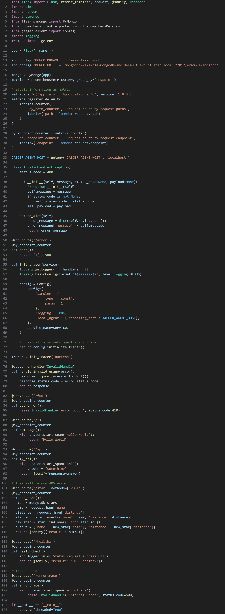
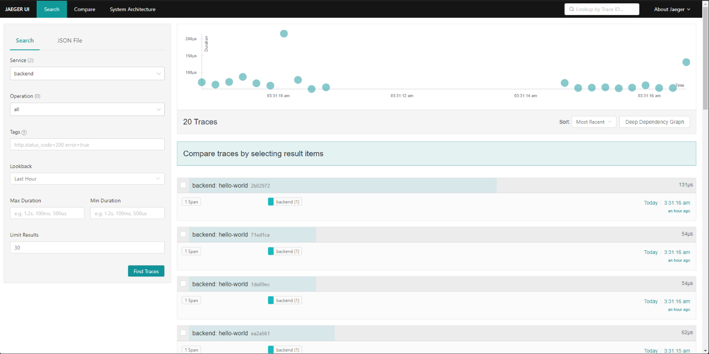

## Jaeger in Dashboards

*TODO:* Now that the trace is running, let's add the metric to our current Grafana dashboard. Once this is completed, provide a screenshot of it here.
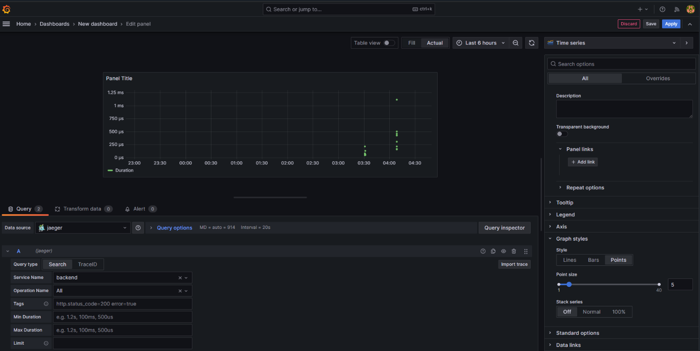

## Report Error

*TODO:* Using the template below, write a trouble ticket for the developers, to explain the errors that you are seeing (400, 500, latency) and to let them know the file that is causing the issue also include a screenshot of the tracer span to demonstrate how we can user a tracer to locate errors easily.

TROUBLE TICKET

Name: Http Response 500 on backend endpoint /errortrace

Date: February 12 2024, 23:50:20.007

Subject: Http Error Response 500 on backend endpoint /errortrace, Invalid Handle

Affected Area: File "/app/app.py", line 123, in errortrace raise InvalidHandle('Internal Error', status_code=500)

Severity: High

Description: class app.InvalidHandle

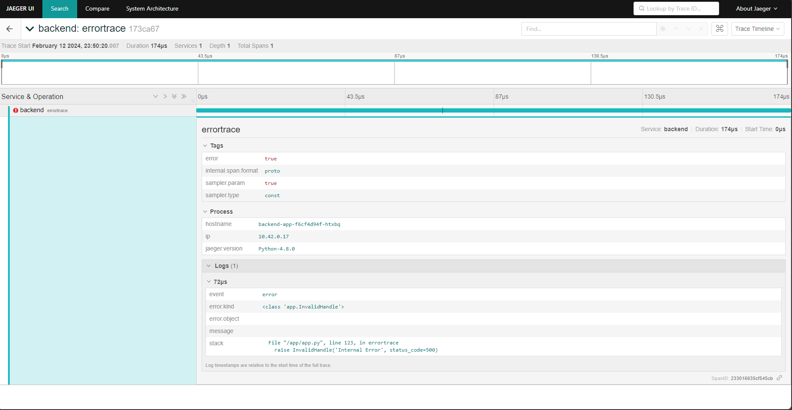

## Creating SLIs and SLOs

*TODO:* We want to create an SLO guaranteeing that our application has a 99.95% uptime per month. Name four SLIs that you would use to measure the success of this SLO.

1. In February 2024, the web application's 20x and 30x status codes' average responses were recorded at 97.99%.
2. During February 2024, 1.5% of all received requests resulted in 50x errors.
3. The average response time for requests in February 2024 was noted to be 1070 milliseconds.
4. For February 2024, the application demonstrated an average CPU usage of 42.65%.
5. Memory consumption for the application averaged at 300MiB in February 2024.

## Building KPIs for our plan

*TODO*: Now that we have our SLIs and SLOs, create a list of 2-3 KPIs to accurately measure these metrics as well as a description of why those KPIs were chosen. We will make a dashboard for this, but first write them down here.

1. The web application's average response rate for 20x and 30x status codes in February 2024 was 97.99%.
    The application's total monthly usability indicates how often it was used.
    Responses for 20x codes each month indicate how frequently the pages of the application were available.
    The total number of requests the application processed is shown in the Traffic Volume per Month field.

2. Of all incoming requests in February 2024, 1.5% yielded 50x status responses.
    Total Monthly Downtime counts the number of times the program was unavailable.
    The application's monthly error rate shows how frequently errors are encountered.
    Request Volume per Month: Indicates the number of requests that the application processed.

3. In February 2024, the application took an average of 1070 ms to process requests.
    Mean Monthly Response Time tells you how long it usually takes the application to respond to requests.
    The application's operational period is quantified by the parameter "Usability Duration per Month."
    The application's total number of managed requests is indicated by the -Application Request Volume.

4. The application's CPU utilization was 42.65% on average in February 2024.
    The main pod of the application's CPU usage is shown by the statistic Mean CPU Utilization per Month for the Primary Pod.
    The collective monthly CPU utilization of all the pods that are keeping the application running is indicated.
    CPU Quota Usage per Month: Determines whether the CPU usage of the application has gone over its allotted limit.

5. In February 2024, the application used 300MiB of memory on average.
    The application's first pod's memory usage is described in - Primary Pod's Monthly Memory Consumption.
    The total memory usage by all of the pods required for the application is shown by the column labeled "Total Monthly Memory Utilization."
    Memory Quota Usage per Month - determines if the program has used more memory than it was allotted.

## Final Dashboard

*TODO*: Create a Dashboard containing graphs that capture all the metrics of your KPIs and adequately representing your SLIs and SLOs. Include a screenshot of the dashboard here, and write a text description of what graphs are represented in the dashboard.  

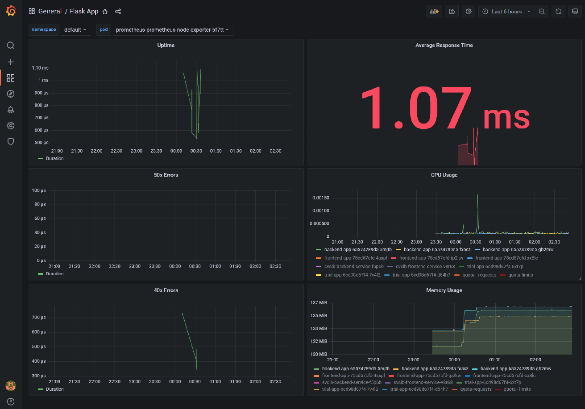

Descriptions for the dashboard panel:

- Uptime: Determines the service's operational state by monitoring the frequency of 20x and 30x status codes.
- Response Time: Calculates the average amount of time it takes to receive a response to a request.
- 50x Errors: Our service's 50x status codes represent the frequency of server errors.
- 40x Errors: Our service's 40x status codes indicate the occurrence of client errors.
- CPU Usage: The extent to which the service is using its CPU resources.
- RAM Usage: The amount of memory that the service is using.
